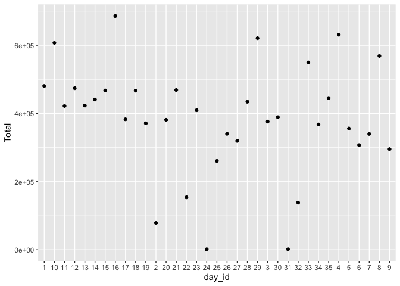
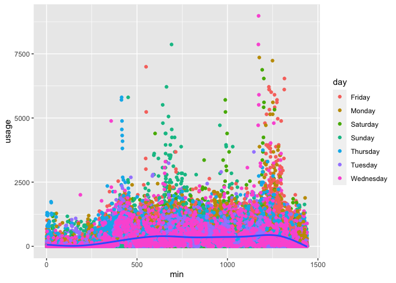
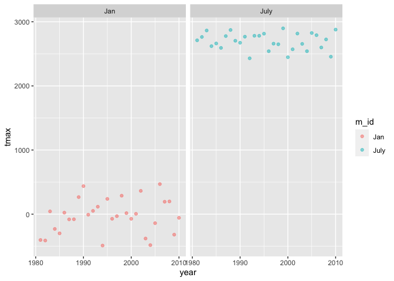
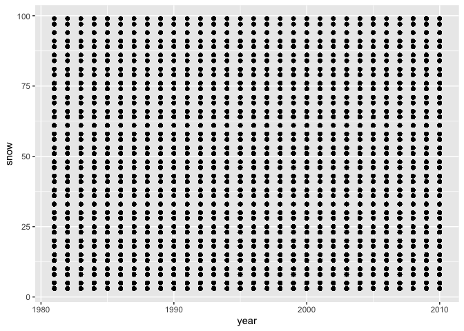
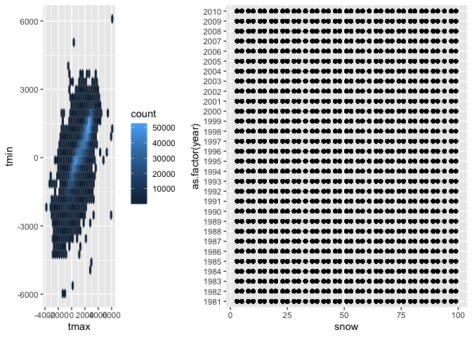

p8105_hw3_jz3570
================
Jiawen Zhao
10/10/2022

## Problem 1

``` r
data("instacart")

instacart = 
  instacart %>% 
  as_tibble(instacart)
```

This dataset contains 1384617 rows and 15 columns, with each row
resprenting a single product from an instacart order. Variables include
identifiers for user, order, and product; the order in which each
product was added to the cart.

Below is a table summarizing the number of items ordered from aisle. In
total, there are 134 aisles, with fresh vegetables and fresh fruits
holding the most items ordered by far.

``` r
instacart %>% 
  count(aisle) %>% 
  arrange(desc(n))
```

    ## # A tibble: 134 × 2
    ##    aisle                              n
    ##    <chr>                          <int>
    ##  1 fresh vegetables              150609
    ##  2 fresh fruits                  150473
    ##  3 packaged vegetables fruits     78493
    ##  4 yogurt                         55240
    ##  5 packaged cheese                41699
    ##  6 water seltzer sparkling water  36617
    ##  7 milk                           32644
    ##  8 chips pretzels                 31269
    ##  9 soy lactosefree                26240
    ## 10 bread                          23635
    ## # … with 124 more rows

Next is a plot that shows the number of items ordered in each aisle.
Here, aisles are ordered by ascending number of items.

``` r
instacart %>% 
  count(aisle) %>% 
  filter(n > 10000) %>% 
  mutate(aisle = fct_reorder(aisle, n)) %>% 
  ggplot(aes(x = aisle, y = n)) + 
  geom_point() + 
  labs(title = "Number of items ordered in each aisle") +
  theme(axis.text.x = element_text(angle = 60, hjust = 1))
```


Our next table shows the three most popular items in aisles
`baking ingredients`, `dog food care`, and `packaged vegetables fruits`,
and includes the number of times each item is ordered in your table.

``` r
instacart %>% 
  filter(aisle %in% c("baking ingredients", "dog food care", "packaged vegetables fruits")) %>%
  group_by(aisle) %>% 
  count(product_name) %>% 
  mutate(rank = min_rank(desc(n))) %>% 
  filter(rank < 4) %>% 
  arrange(desc(n)) %>%
  knitr::kable()
```

| aisle                      | product_name                                  |    n | rank |
|:---------------------------|:----------------------------------------------|-----:|-----:|
| packaged vegetables fruits | Organic Baby Spinach                          | 9784 |    1 |
| packaged vegetables fruits | Organic Raspberries                           | 5546 |    2 |
| packaged vegetables fruits | Organic Blueberries                           | 4966 |    3 |
| baking ingredients         | Light Brown Sugar                             |  499 |    1 |
| baking ingredients         | Pure Baking Soda                              |  387 |    2 |
| baking ingredients         | Cane Sugar                                    |  336 |    3 |
| dog food care              | Snack Sticks Chicken & Rice Recipe Dog Treats |   30 |    1 |
| dog food care              | Organix Chicken & Brown Rice Recipe           |   28 |    2 |
| dog food care              | Small Dog Biscuits                            |   26 |    3 |

``` r
instacart %>%
  filter(product_name %in% c("Pink Lady Apples", "Coffee Ice Cream")) %>%
  group_by(product_name, order_dow) %>%
  summarize(mean_hour = mean(order_hour_of_day)) %>%
  spread(key = order_dow, value = mean_hour) %>%
  knitr::kable(digits = 2)
```

    ## `summarise()` has grouped output by 'product_name'. You can override using the
    ## `.groups` argument.

| product_name     |     0 |     1 |     2 |     3 |     4 |     5 |     6 |
|:-----------------|------:|------:|------:|------:|------:|------:|------:|
| Coffee Ice Cream | 13.77 | 14.32 | 15.38 | 15.32 | 15.22 | 12.26 | 13.83 |
| Pink Lady Apples | 13.44 | 11.36 | 11.70 | 14.25 | 11.55 | 12.78 | 11.94 |

## Problem 2

``` r
library (tidyverse)
accel <- read.csv("data/accel_data.csv")%>% 
  janitor::clean_names()%>%  
  na.omit()%>% 
  mutate(weekday_vs_weekend = case_when(day == "Monday" ~ 'weekday', day == "Tuesday" ~ 'weekday',day ==  "Wednesday" ~ 'weekday', day == "Thursday" ~ 'weekday', day == "Friday" ~ 'weekday', day == "Sunday" ~ 'weekend',day == "Saturday" ~ 'weekend'),  .after = day)
accel[,5:1444] <- sapply(accel[,5:1444], as.double)
accel[,1:4] <- sapply(accel[,1:4], as.character)
accel = mutate(accel,Total = rowSums(accel[5:1444]),  .after = day)

table_mini = accel[,1:4]
ggplot(table_mini, aes(x = day_id, y = Total))  + geom_point() # trend
```



``` r
Accelerometer = 
  pivot_longer(
    accel, 
    activity_1:activity_1440,
    names_to = "time", 
    values_to = "usage")%>% 
  mutate(min = gsub("activity_","",as.character(time)))%>% 
  mutate(min = as.numeric(min))%>% 
  select(-time)

ggplot(Accelerometer, aes(x = min, y = usage)) + 
  geom_point(aes(color = day))+
  geom_smooth(se = FALSE)
```

    ## `geom_smooth()` using method = 'gam' and formula 'y ~ s(x, bs = "cs")'



### The resulting dataset is Accelerometer. It has 7 variables, week, day_id, day, Total, weekday_vs_weekend, usage, min.There are 50400 observations. After aggregate across minutes, a total activity variable is created for each day, and it’s summerized in the table called table_mini. It sows a decreasing trend in general. From the graph, we see that the usage is generally low during the first 200 minutes of a day, then get higher from 500-1200 minutes, finally get back to low at the end of each day. There are several outliers that are very high usage during Friday, Saterday and Monday.

## Problem 3

``` r
library(p8105.datasets)
data("ny_noaa")
ny_noaa <- separate(ny_noaa, date, into = c("year", "month", "day"), sep = '-')
ny_noaa[,2:4] <- sapply(ny_noaa[,2:4], as.integer)
ny_noaa[,5:9] <- sapply(ny_noaa[,5:9], as.double)
ny_noaa <- mutate(ny_noaa, prcp = prcp*100, tmax = tmax*10, tmin = tmin*10)
tail(names(sort(table(ny_noaa$snow))), 1) ## most common value is 0.
```

    ## [1] "0"

``` r
jan = filter(ny_noaa, month == 1)
ave_tmax_jan = aggregate(tmax ~ year, jan, mean) ## average tmax for each year's jan

july = filter(ny_noaa, month == 7)
ave_tmax_july = aggregate(tmax ~ year, july, mean)## average tmax for each year's july

ave_tmax_jan$m_id <- "Jan"
ave_tmax_july$m_id <- "July"

tmax_sum <- rbind(ave_tmax_jan, ave_tmax_july)
ggplot(tmax_sum, aes(x = year, y = tmax, color = m_id)) + 
  geom_point(alpha = .5) +
  facet_grid(. ~ m_id)
```



``` r
snow_less_100 = filter(ny_noaa, snow <100 & snow > 0)

ggplot(snow_less_100, aes(x = year, y = snow)) + geom_point()
```



## The dataset has 9 veriables(columns). They are id, year, month, day, prcp, snow, snwd, tmax, tmin, where the id is the id of each weather station, prcp is Precipitation, snow is Snowfall, snwd is Snow depth, tmax: Maximum temperature, tmin is Minimum temperature. The unit here should be mm and C, but some variables have unit of tenths of mm or tenths of C. So, we need to multiply them by 10 to make the units comparable. Celsius is a unit used internationally, so there’s no need to transfer it to fahrenheit. There are 2595176 observations in the dataset. A lot of the cells have NA value. That caused some problem when analysising the data.

## For snow, the most commonly observed value is 0, and it’s because snow is relatively rare during a year, compared to other weather conditions.

## From the plot of max temprature in Jan and July, we see tht the temperature in January is usually around 0 C degree, which is very low, and the temperature in July is around 25-30 C degree, which is very high. Althoug hthere are two outliers in January 2990 and January 2006, which have higher temerature compared to other years’ January, the variation is generally small in both plots, which means the average max temperature in January and July across those 30 years are relatively stable, seasonal changes are obvious.

``` r
par(mfrow=c(1,2))
p1 = ggplot(ny_noaa, aes(tmax, tmin))+ geom_hex()
p2 = ggplot(snow_less_100, aes(y = as.factor(year), x = snow)) + geom_point()
library(cowplot)
```

    ## 
    ## Attaching package: 'cowplot'

    ## The following object is masked from 'package:patchwork':
    ## 
    ##     align_plots

``` r
plot_grid(p1, p2, rel_widths = c(1.3,2))
```


